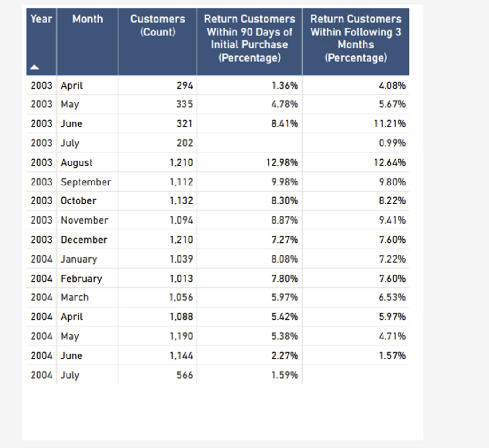
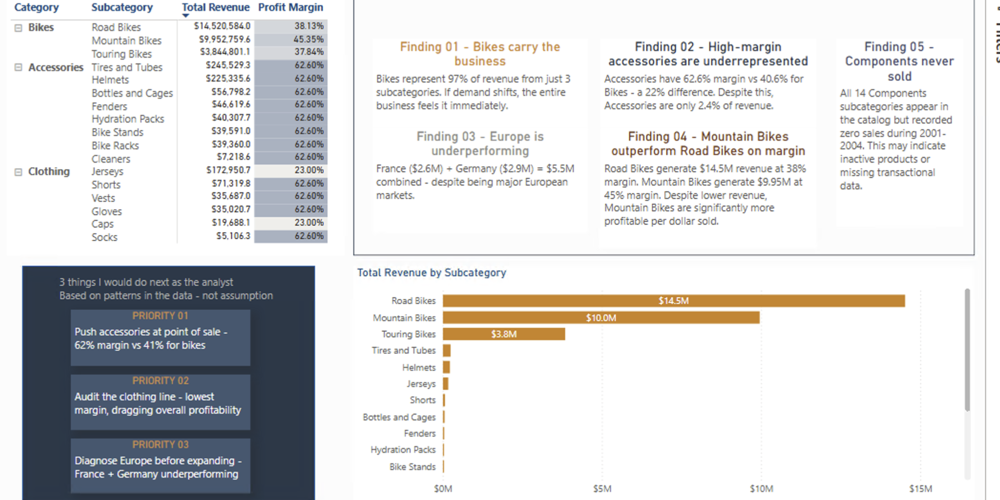
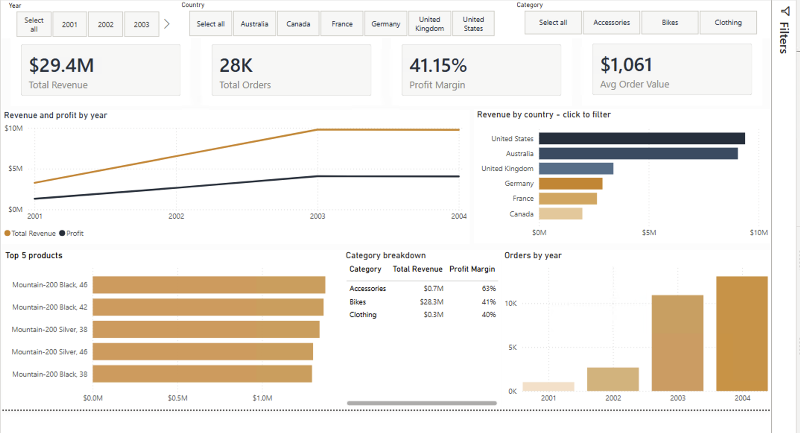

# Sales & Retention Analytics (Power BI)

An end to end Power BI project analyzing retail sales for a bicycle retailer (2001 to 2004). Includes data modeling, Power Query cleaning, DAX measures, and a full executive dashboard.

## Customer Retention

Monthly cohort table tracking repeat purchase behavior: what percent of each month's customers returned within 90 days, and within the following 3 months.

Repeat purchase rates peak in August 2003 at 12.98% within 90 days, then trend downward through 2004. Worth investigating alongside a marketing or promotional calendar in a follow up.

## Category & Findings

Key takeaways:
1. Bikes carry the business. 97% of revenue comes from just 3 subcategories, so a demand shift anywhere in Bikes moves the whole business.
2. High margin Accessories are underrepresented. 62.6% margin vs. 40.6% for Bikes, yet only 2.4% of revenue.
3. Europe is underperforming. France and Germany combined ($5.5M) trail other major markets.
4. Mountain Bikes outperform Road Bikes on margin. $9.95M revenue at 45% margin vs. Road Bikes' $14.5M at 38%, meaningfully more profitable per dollar sold.
5. Components never sold. All 14 Component subcategories show zero transactions in the analysis period.

Recommended actions:
1. Push Accessories at point of sale. 62% margin vs. 41% for Bikes, currently a missed upsell.
2. Audit the Clothing line, the lowest margin category and a drag on overall profitability.
3. Diagnose Europe before expanding, since France and Germany are underperforming relative to other markets.

## Dashboard Overview

$29.4M total revenue across 28K orders, 41.15% profit margin, and a $1,061 average order value (2001 to 2004).

## Data & Modeling

Tables: Sales (60,398 rows), Customers (18,484 rows), Products (397 rows), ProductCategories (37 rows).

Data quality issues found and handled:
- `DiscountAmount` was zero across all 60,398 rows, so it was excluded from analysis rather than left in to silently understate discounting impact.
- Component subcategories present in the catalog with no sales transactions in 2001 to 2004, documented as a likely data gap rather than dropped silently.
- `EndDate` nulls in Products confirmed as expected for active or current products, not missing data.

Modeling: star schema with single direction relationships (Sales to Customers, Sales to Products, Products to ProductCategories, DateTable to Sales), DateTable built with `CALENDARAUTO()`. All transformations done in Power Query only, no external data blended in.

Validation: source row counts verified after import, referential integrity confirmed (all 18,484 customers matched after CustomerKey normalization), and DAX measures validated against source data.
